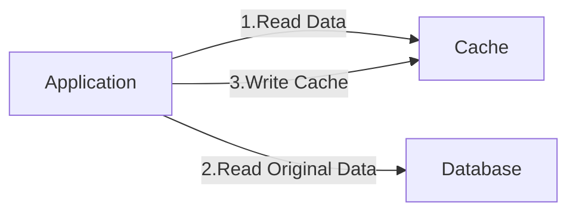
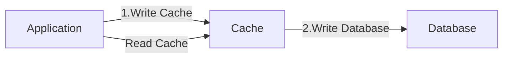
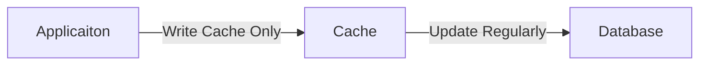

# Caching

<figure><figcaption></figcaption></figure>

## Caching

* Cache는 성능 향상을 위해 값을 복사해 놓는 임시 기억 장치
* Cache에 복사본을 저장해놓고 읽음으로서 속도가 느린 장치로의 접근 횟수를 줄임
* Cache 데이터는 원본이 아니며 언제든 사라질 수 있음

## Caching 용어

* 캐시 적중(Cache Hit): 캐시에 접근해 데이터를 발견
* 캐시 미스(Cache Miss): 캐시에 접근했으나 데이터를 발견하지 못함
* 캐시 삭제 정책(Eviction Policy): 캐시의 데이터 공간 확보를 위해 저장된 데이터를 삭제
* 캐시 전략: 환경에 따라 적합한 운영 방식을 선택(Cache-Aside, Write-Through..)

### Cache-Aside(Lazy Loading)

* 항상 캐시를 먼저 체크하고, 없으면 원본(Database)에서 읽어온 후에 캐시에 저장
* 장점: 필요한 데이터만 캐시에 저장되고, Cache Miss가 있어도 치명적이지 않음
* 단점: 최초 접근은 느림, 업데이트 주기가 일정하지 않기 때문에 캐시가 최신 데이터가 아닐 수 있음

### Write-Through

* 데이터를 쓸 때 항상 캐시를 업데이트하여 최신 상태를 유지
* 장점: 캐시가 항상 동기화되어 있어 데이터가  최신이다
* 단점: 자주 사용하지 않는 데이터도 캐시되고, 쓰기 지연시간이 증가

### Write-Back

* 데이터를 캐시에만 쓰고, 캐시의 데이터를 일정 주기로 Database에 업데이트
* 장점: 쓰기가 많은 경우 Database 부하를 줄일 수 있음
* 단점: 캐시가 Database에 쓰기 전에 장애가 생기면 데이터 유실 가능

### 데이터 제거 방식

* 캐시에서 어떤 데이터를 언제 제거할 것인가?
* Expiration: 각 데이터에 TTL(Time-To-Live)를 설정해 시간 기반으로 삭제
* Eviction Algorithm: 공간을 확보해야 할 경우 어떤 데이터를 삭제할지 결정하는 방식
  * LRU(Least Recently Used): 가장 오랫동안 사용되지 않은 데이터를 삭제
  * LFU(Least Frequently Used): 가장 적게 사용된 데이터를 삭제
  * FIFO(First In First Out): 먼저 들어온 데이터를 삭제

## 참고


