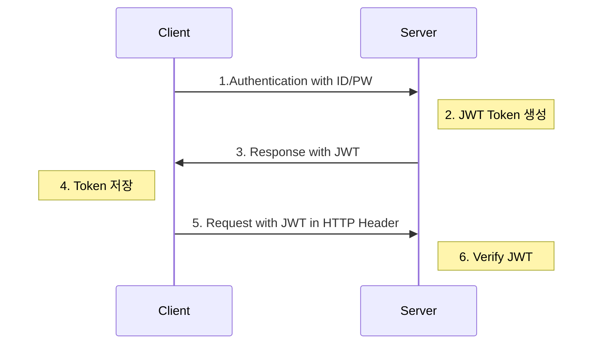
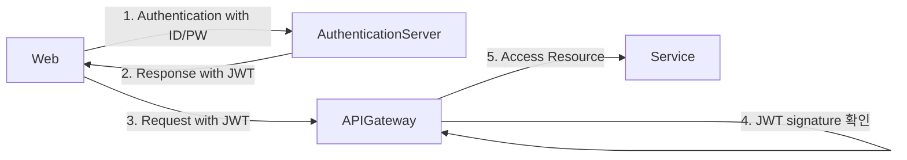

# JWT

## JWT(Json Web Tokens)

* JWT는 유저를 인증하고 식별하기 위한 Token기반 인증이다
* Token은 Session과 다르게 서버가 아닌 _**클라이언트**_에 저장
* 메모리나 스토리지를 통해 세션을 관리 했던 서버의 부담을 줄여줌
* Token 자체에 사용자의 권한 정보나 서비스를 사용하기 위한 정보가 포함(Self-Contained)

## JWT 구조

<figure><figcaption>
<a href="https://ansibytecode.com/jwt-peek-into-the-jargon-java-web-token/">https://ansibytecode.com/jwt-peek-into-the-jargon-java-web-token/</a>
</figcaption></figure>

### Header

Token의 Type과 Hash 암호화 알고리즘으로 구성되어있다.

### Payload

Token에 담을 claim 정보를 포함하고 있다. key-value로 이루어져 있고, 여러개의 claim을 넣을 수 있다.

### Signature

서명(Signature)는 위에서 만든 Header와 Payload의 값을 각각 base64로 인코딩하고, 인코딩한 값을 secret key를 이용해 Header에서 정의한 알고리즘으로 Hashing을 하고, 이 값을 다시 base64로 인코딩하여 생성한다.

## JWT 사용시 주의사항

* Payload의 data가 많아지면 Token의 사이즈가 커질 수 있다
* 한번 발급된 이후 사용자의 정보를 바꾸더라도 Token을 재발급 하지 않으면 반영되지 않는다
* 클라이언트에서 Token을 관리하기 때문에, 변조의 위협이 생겨도 서버에서 강제로 토큰을 삭제하지 못한다.
* 토큰의 재사용을 막기 위해 만료주기를 짧게 설정한다.
* Token의 만료시간이 있는 경우 만료시간까지는 강제적으로 만료시킬 수 없으므로 민감정보를 넣지 않는다

## 분산 환경(Spring Cloud)에서의 JWT 활용

## :pencil: Reference

* [https://incheol-jung.gitbook.io/docs/q-and-a/infra/jwt](https://incheol-jung.gitbook.io/docs/q-and-a/infra/jwt)
* [https://pronist.dev/143#%EB%8D%94%20%EC%9D%BD%EC%9D%84%EA%B1%B0%EB%A6%AC-1](https://pronist.dev/143#%EB%8D%94%20%EC%9D%BD%EC%9D%84%EA%B1%B0%EB%A6%AC-1)
* [https://pronist.tistory.com/145](https://pronist.tistory.com/145)

## :gift: Advertisement


"이 포스팅은 쿠팡 파트너스 활동의 일환으로, 이에 따른 일정액의 수수료를 제공받습니다."

