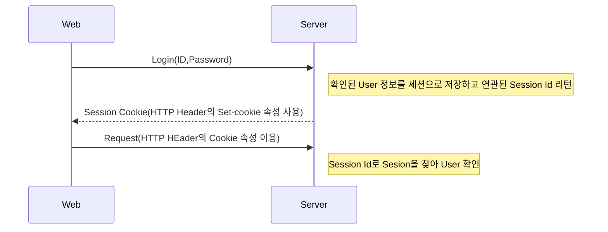
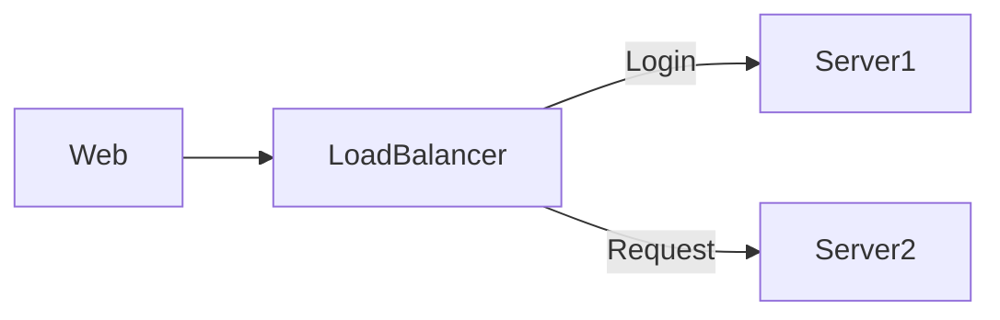
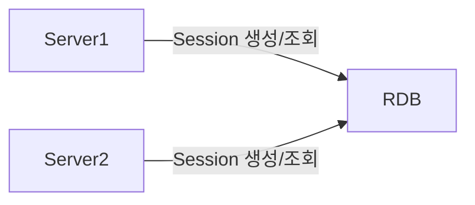
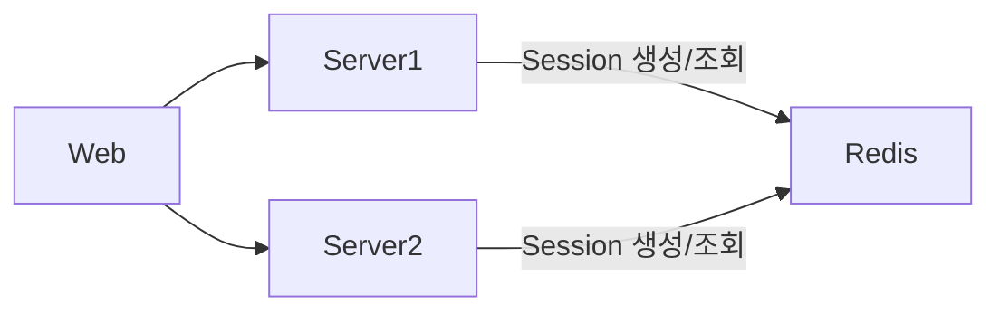

# Session

<figure><figcaption></figcaption></figure>

## 세션(Session)

* Web 상에서 특정 유저가 로그인했음을 나타내는 정보
* 브라우저는 Cookie를, 서버는 해당 Cookie에 연관된 세션 정보를 저장한다.
* 유저가 로그아웃하거나 세션이 만료될 때 까지 유지되어 유저에 특정한 서비스 가능

## 분산 환경에서의 세션 처리

* Server는 세션 정보를 저장해야 함
* Server가 여러개라면 최초 로그인 한 Server가 아닌 다른  Server는 세션 정보를 알 수 없음
* 세션 정보를 Server들이 공유할 방법이 필요함(Session Cluster)

## 그러면 세션은 어디에 저장해야할까?

### Relational Database 사용

* 관계형 데이터 모델이 필요한가?
  * Session Data는 단순하게 Session Id와 User 정보의 1:1 매핑 관계
* 영속성이 필요한 데이터인가?
  * Session Data의 생명주기는 굉장히 짧다(로그인 시간동안에만 필요한 Data)
* 성능 요구사항을 충족하는가?
  * Session 데이터는 모든 Request에 대해 Access가 이뤄지기 때문에 굉장히 빈번하게 일어난다.

### Redis 사용

* Session Data는 단순 key-value 구조
* Session Data는 영속성이 필요 없음
* Session Data는 변경이 빈번하고 빠른 Access 속도가 필요

## :pencil: Reference


